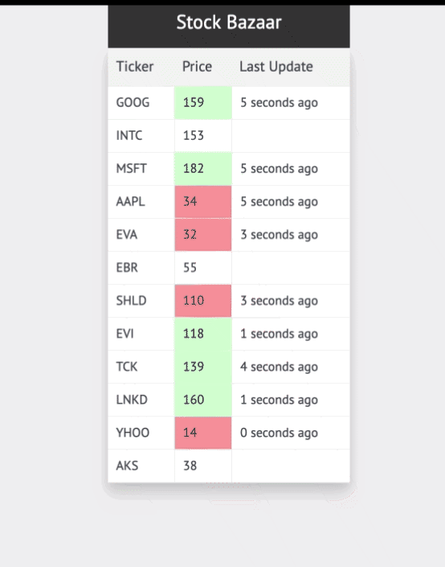

# Stock Bazaar

Stock Bazaar is stock ticker app. Below are the technologies used in this app:

  - ReactJS
  - Websocket
  - Graphs (to do)

  You can view the live demo of Stock Bazaar [here](https://karanmehta.github.io/stock-bazaar-app/).

  
  
### NOTE: 
Javascript execution has been blocked on live demo page due to "Mixed content" error. But there's a workaround, If you are using Chrome browser on Desktop, then click on "Shield" icon on right-end side of titlebar and then click on "Load Unsafe Scripts" to start the app.

### What I learned

* Hash Table - Hash Table is the quickest way to access and update the data
* Graph Chart - Read about react-sparkline (implementation in progress)

### Installation
Stock Bazaar requires [Node.js](https://nodejs.org/) v9+ to run.

Install the dependencies and devDependencies and start the server.

```sh
$ cd stock-bazaar
$ npm install
$ npm start
```

For production environments...

```sh
$ npm run prod
```

### Todos

 - Build utility components (table)
 - Add Graphs
 - Enhance UI
 - Add Dark Mode

License
----

Mozilla Public License 2.0